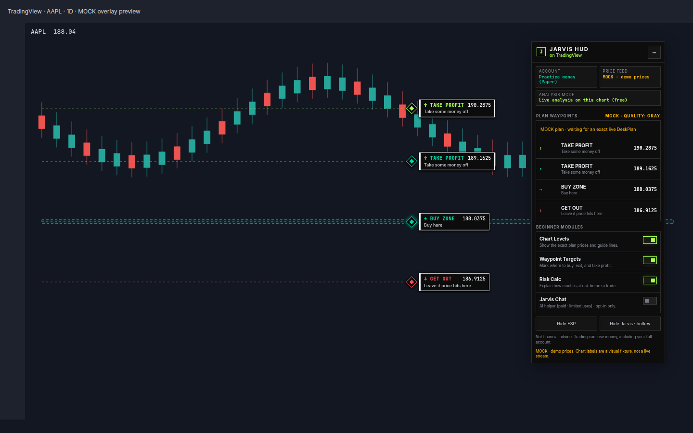
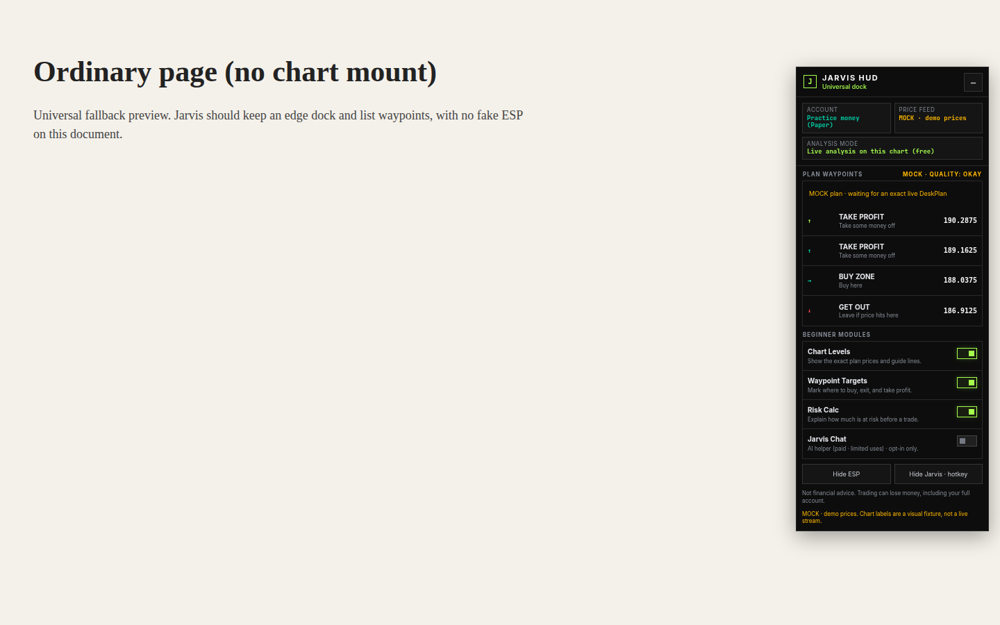

# Multi-host demo and screenshot notes

Use a desktop viewport at least 1280px wide. Stills below are captured from the real HUD (`demo/tradingview.html` and `demo/universal.html`) with honest **MOCK · demo prices**. They are a COO preview pack, not a Design PASS for live host-axis accuracy.

## COO preview stills (in this PR)

### TradingView — on-chart ESP



- Host badge: **on TradingView**
- On-chart: ↑ TAKE PROFIT, → BUY ZONE, ↓ GET OUT + mono prices
- Dock: **Practice money (Paper)** and **MOCK · demo prices** (not Delayed)
- Dual channel: list + chart beacons
- Reward:risk stays inside the collapsed **Why** expander

### Universal — dock only



- Host badge: **Universal dock**
- Plan list + Paper + MOCK chip
- No beacons, tracers, or ESP on the unknown page

## Replay the stills locally

```bash
python3 -m http.server 8765
# open http://127.0.0.1:8765/demo/tradingview.html
# open http://127.0.0.1:8765/demo/universal.html
```

Or load the extension unpacked and open a public TradingView Superchart.

## Remaining live-host captures

Yahoo/Webull on real host pages are still outstanding. This pack unblocks Randy preview with TV + Universal.
